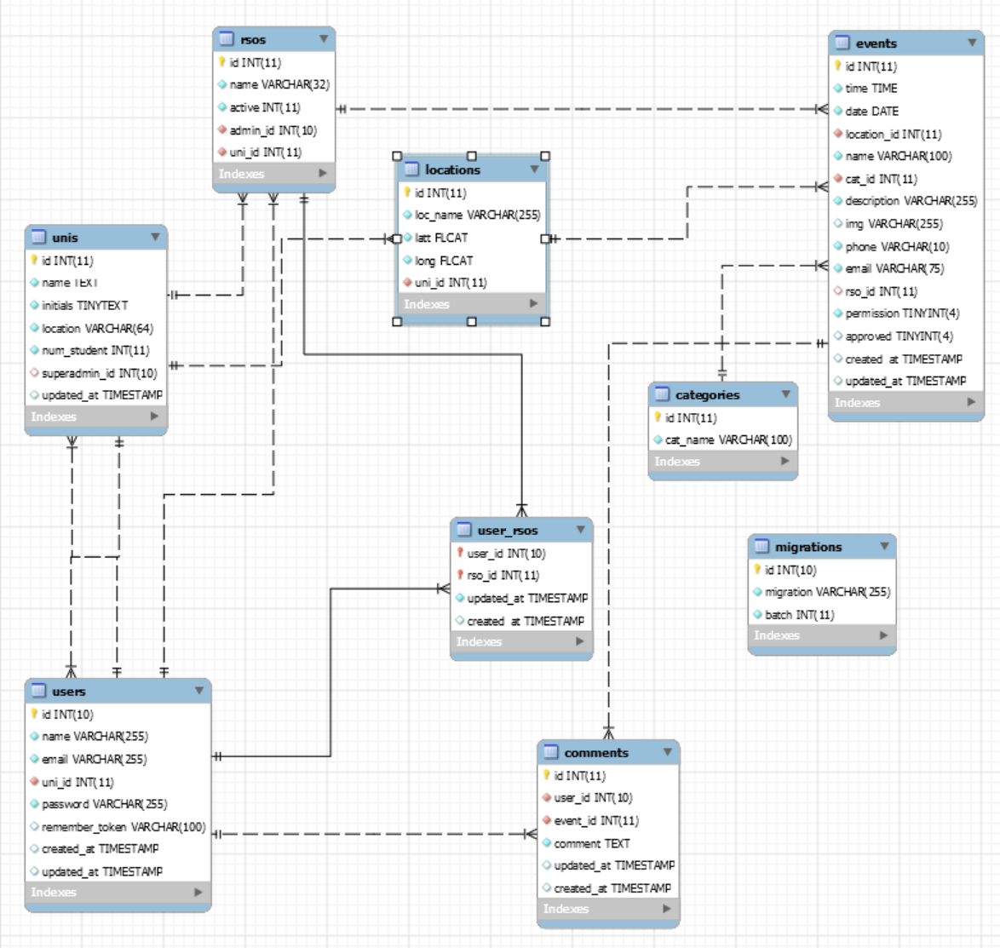

# College Events Website & Database COP 4710
**Installation**

Get Vendor folder by running:
```
composer update
```

Make sure you have a .env file or copy the .env.example

```
php artisan key:generate
```

Start webservice: run on folder

```
php artisan serve
```

**EER Diagram**


